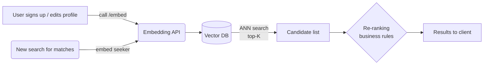

## Using Embeddings in Our AI-First Dating Prototype

### 1. What _is_ an embedding model?

An **embedding model** is a neural network that converts a chunk of data—text, images, audio, user-interaction graphs—into a fixed-length list of numbers (_a vector_). During training those vectors are nudged so that conceptually similar inputs end up **close together** in the high-dimensional space and dissimilar ones end up far apart. Each vector acts as a **compact semantic fingerprint** of the original content.

---

### 2. Why embeddings are perfect for a match-by-interests app

| Problem we face                                     | How embeddings help                                                        |
| --------------------------------------------------- | -------------------------------------------------------------------------- |
| Profiles are free-form text with slang & typos      | Language models embed semantics, so “snowboarding” ≈ “hitting the slopes”. |
| Need cold-start matching before chat history exists | A single survey-answer block can already be embedded and compared.         |
| Want _latent_ compatibility (values, lifestyle)     | Vectors capture nuance beyond explicit tags.                               |

---

### 3. Where the vectors come from

1. **Profile & survey answers** → sentence-level text embedding model (OpenAI `text-embedding-3-small`, HF `all-MiniLM-L6-v2`).
2. **Optional images / Spotify tastes** → compatible image or audio model; concatenate or average with text vectors.
3. **User interaction signals** (likes, skips, message sentiment) → periodically fine-tune a dual-tower model so that “people I liked” pull closer together.

---

### 4. End-to-end flow for the prototype

